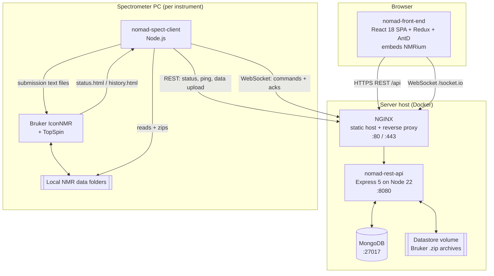
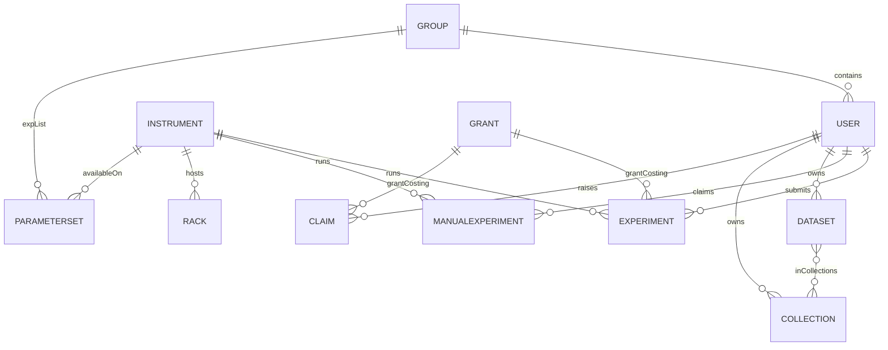
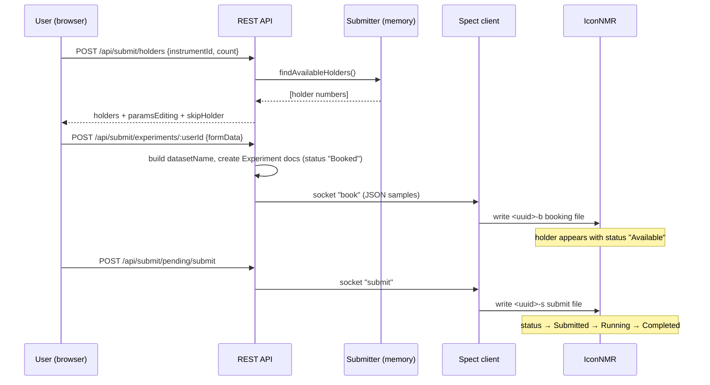
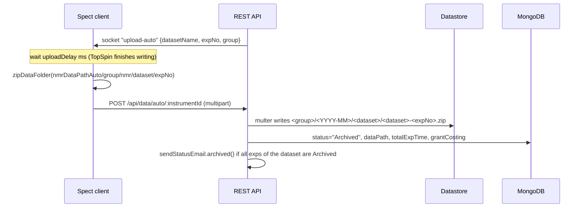
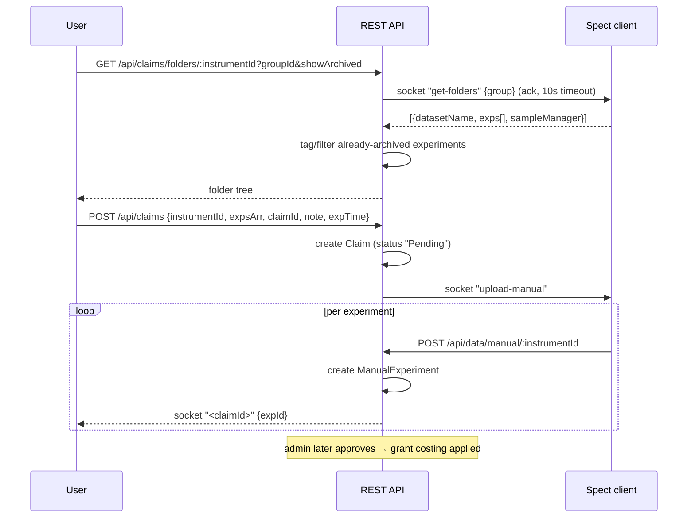

# NOMAD — Technical Specification

**NMR Online Management And Datastore**

|                  |                                                                                                                                  |
| ---------------- | -------------------------------------------------------------------------------------------------------------------------------- |
| Document version | 1.0                                                                                                                              |
| Date             | 21 August 2026                                                                                                                   |
| Applies to       | `nomad-rest-api` 3.7.1, `nomad-front-end` 3.7.1, `nomad-spect-client` 3.6.3-beta                                                 |
| Repositories     | [nomad-server](https://github.com/nomad-nmr/nomad-server), [nomad-spect-client](https://github.com/nomad-nmr/nomad-spect-client) |
| Licence          | AGPL-3.0                                                                                                                         |
| Project site     | <https://www.nomad-nmr.uk>                                                                                                       |

---

## Table of contents

1. [Purpose and scope](#1-purpose-and-scope)
2. [System overview](#2-system-overview)
3. [Architecture](#3-architecture)
4. [Deployment topology](#4-deployment-topology)
5. [Data model](#5-data-model)
6. [Identifiers and naming conventions](#6-identifiers-and-naming-conventions)
7. [Authentication and authorisation](#7-authentication-and-authorisation)
8. [REST API specification](#8-rest-api-specification)
9. [Real-time messaging (Socket.IO)](#9-real-time-messaging-socketio)
10. [Spectrometer client specification](#10-spectrometer-client-specification)
11. [Core workflows](#11-core-workflows)
12. [Datastore and file layout](#12-datastore-and-file-layout)
13. [Accounting, grants and traffic control](#13-accounting-grants-and-traffic-control)
14. [Statistics module](#14-statistics-module)
15. [Front-end specification](#15-front-end-specification)
16. [Configuration reference](#16-configuration-reference)
17. [Testing and CI/CD](#17-testing-and-cicd)
18. [Known constraints and design notes](#18-known-constraints-and-design-notes)

---

## 1. Purpose and scope

This document specifies the technical design of NOMAD: its components, data model,
interfaces, protocols and operational configuration. It is written for developers
maintaining or extending the system, and for administrators deploying it in an NMR
facility.

It describes the system **as implemented** in the source tree, and complements — rather
than replaces — the user-facing documentation at <https://www.nomad-nmr.uk/docs> and the
white paper at <https://www.nomad-nmr.uk/docs/whitepaper>.

Out of scope: NMRium internals, Bruker IconNMR/TopSpin internals, and site-specific
infrastructure (TLS certificate issuance, backup schedules, network policy).

---

## 2. System overview

NOMAD is an open-source web application that manages the full lifecycle of NMR
experiments in a facility: booking instrument time, submitting experiments to Bruker
IconNMR, tracking their progress in real time, automatically archiving the resulting
raw data, and making it findable, viewable and downloadable afterwards. It is built
around F.A.I.R. data principles — the raw dataset never has to leave the facility store
to be usable.

The system provides five functional modules, each of which can be enabled or disabled at
build/run time:

| Module                | Purpose                                                          | Feature flag                         |
| --------------------- | ---------------------------------------------------------------- | ------------------------------------ |
| **Dashboard**         | Live instrument status, queues, errors, usage summary            | always on                            |
| **Submission portal** | Walk-in booking and submission of experiments to instruments     | `VITE_SUBMIT_ON` / `SUBMIT_ON`       |
| **Batch submission**  | Rack/SampleJet-based bulk sample submission                      | `VITE_BATCH_SUBMIT_ON`               |
| **Datastore**         | Automatic archival, search, NMRium lab notebook, collections     | `VITE_DATASTORE_ON` / `DATASTORE_ON` |
| **Accounting**        | Experiment-time accounting, instrument costing, grant allocation | always on (per-user gated)           |

A reference deployment at the University of St Andrews serves ~200 active users across
six spectrometers and archives 400+ experiments per day at peak.

---

## 3. Architecture

### 3.1 Components

NOMAD is a JavaScript MERN application composed of three deployable components plus a
database.



### 3.2 Technology stack

| Layer               | Technology                                                                                                                                                                                                                            |
| ------------------- | ------------------------------------------------------------------------------------------------------------------------------------------------------------------------------------------------------------------------------------- |
| Front end           | React 18, Vite 8, Redux 5 + redux-thunk, React Router 7, Ant Design 6, axios, socket.io-client, NMRium 1.11, OpenChemLib / react-ocl, Recharts, moment/dayjs                                                                          |
| Back end            | Node.js 22, Express 5, Mongoose 9, socket.io 4, jsonwebtoken, bcryptjs, multer 2, JSZip, nodemailer, express-validator, helmet, swagger-ui-express, `@zakodium/nmrium-core-plugins`, openchemlib, moment(-timezone, -duration-format) |
| Database            | MongoDB (single instance, no replica set required)                                                                                                                                                                                    |
| Spectrometer client | Node.js, axios, socket.io-client, tabletojson, JSZip, form-data, yargs, prompt, chalk                                                                                                                                                 |
| Web server          | NGINX (mainline-alpine)                                                                                                                                                                                                               |
| Runtime supervision | PM2 (`pm2-runtime`) inside the API container                                                                                                                                                                                          |
| Packaging           | Docker + Docker Compose                                                                                                                                                                                                               |

### 3.3 Communication channels

| #   | From → To              | Transport                        | Payload                                                                                    |
| --- | ---------------------- | -------------------------------- | ------------------------------------------------------------------------------------------ |
| 1   | Browser → API          | HTTPS REST, JSON, Bearer JWT     | All CRUD and query operations                                                              |
| 2   | API → Browser          | Socket.IO (room `users`)         | `statusUpdate`, per-claim archival progress                                                |
| 3   | Spect client → API     | HTTPS REST                       | `PATCH /api/tracker/status`, `GET /api/tracker/ping/:id`, multipart data upload            |
| 4   | API → Spect client     | Socket.IO (unicast by socket id) | `book`, `submit`, `delete`, `upload-auto`, `upload-manual`, `upload-repair`, `get-folders` |
| 5   | Spect client ↔ IconNMR | Local filesystem                 | Reads HTML status/history tables; writes submission command files                          |
| 6   | API ↔ Datastore        | Local filesystem / volume        | Bruker dataset ZIP archives                                                                |

The spectrometer client is a **socket client**, never a server: it always initiates the
connection outward, so no inbound port needs to be opened on the spectrometer PC.

---

## 4. Deployment topology

### 4.1 Docker images

Three images are published to Docker Hub by CI on release:

| Image                 | Dockerfile            | Contents                                                                    |
| --------------------- | --------------------- | --------------------------------------------------------------------------- |
| `nomadnmr/api`        | `Dockerfile.api`      | Node 22-slim, production deps, `pm2-runtime app.js`, exposes 8080           |
| `nomadnmr/server`     | `Dockerfile.serv`     | Multi-stage: Vite build of the SPA → NGINX alpine, `nginx.conf`, exposes 80 |
| `nomadnmr/server-tls` | `Dockerfile.serv-tls` | As above with `nginx.conf-tls`, exposes 443                                 |

Front-end feature flags are baked in at image build time as `ENV VITE_*` values consumed
by Vite, and `VITE_API_URL=/api` so the SPA speaks to the API through the same origin.

### 4.2 NGINX routing

| Location      | Target                       | Notes                                                                                              |
| ------------- | ---------------------------- | -------------------------------------------------------------------------------------------------- |
| `/`           | `/react-builds/frontend/`    | SPA fallback `try_files $uri /index.html`                                                          |
| `/api/`       | `http://api:8080/api/`       | Reverse proxy                                                                                      |
| `/data/`      | `http://api:8080/api/data/`  | Separate block: `client_max_body_size 250M`, `proxy_read_timeout 30s`, `proxy_connect_timeout 75s` |
| `/socket.io/` | `http://api:8080/socket.io/` | HTTP/1.1 with `Upgrade`/`Connection: upgrade` headers                                              |
| `/downloads`  | `alias /app/downloads`       | Static distribution of client installers/binaries                                                  |

The TLS variant listens on 443 with HTTP/2, `ssl_certificate /ssl/nomad3.pem`,
`ssl_certificate_key /ssl/nomad3.key`, `ssl_ciphers HIGH:!aNULL:!MD5`.

### 4.3 Development environment

`docker-compose.yaml` in `nomad-server` defines four services:

| Service    | Build/Image                                | Ports | Volumes                                                    |
| ---------- | ------------------------------------------ | ----- | ---------------------------------------------------------- |
| `mongodb`  | `mongo`                                    | 27017 | named volume `mongo-data`                                  |
| `backend`  | `./nomad-rest-api`                         | 8080  | source bind mount, `./datastore`, `./downloads`            |
| `frontend` | `./nomad-front-end`                        | 3003  | `src` bind mount, `./downloads`                            |
| `client`   | `../nomad-spect-client` (profile `client`) | —     | `src`, `status_files`, `submit_files`, host NMR data paths |

Commands:

```bash
docker-compose up -d                    # server only
docker-compose --profile client up -d   # server + spectrometer client
docker-compose up -d --build            # rebuild after dependency changes
docker-compose down
```

Database dump/restore:

```bash
docker exec -i nomad-server-mongodb-1 sh -c 'mongodump --archive' > mongodb.dump
docker exec -i nomad-server-mongodb-1 sh -c 'mongorestore --archive --drop' < mongodb.dump
```

### 4.4 Bootstrap behaviour

On start (`server.js`), when `NODE_ENV !== 'test'` the API:

1. Connects to `MONGODB_URL` (default `mongodb://mongodb:27017/nomad`).
2. Creates a `default` group if the `groups` collection is empty.
3. Creates an `admin` user if the `users` collection is empty, with password
   `ADMIN_PASSWORD`, `accessLevel: 'admin'`, `dataAccess: 'admin'`, email
   `admin@$EMAIL_SUFFIX`.
4. Clears all stored JWTs (`tokens: []`) for active users unless `NODE_ENV === 'dev'`.
5. Starts the Express listener on `HOST` (default `0.0.0.0`) : `PORT` (default 8080).
6. Initialises Socket.IO and the in-memory `Submitter` singleton.

---

## 5. Data model

MongoDB collections, defined as Mongoose schemas in `nomad-rest-api/models/`. All
schemas except `Grant`, `Instrument` and `Rack` carry `timestamps: true`
(`createdAt`/`updatedAt`).



### 5.1 `User`

| Field                      | Type                                 | Notes                                          |
| -------------------------- | ------------------------------------ | ---------------------------------------------- |
| `username`                 | String, unique, required, trimmed    | Lower-cased on creation                        |
| `fullName`                 | String                               | Validated `/^[a-z' ]+$/i`, ≤ 50 chars          |
| `password`                 | String, required                     | bcrypt hash (salt rounds from `bcrypt-salt`)   |
| `accessLevel`              | String, default `'user'`             | See §7.2                                       |
| `dataAccess`               | String                               | Overrides group setting when defined; see §7.3 |
| `email`                    | String, required, unique in practice |                                                |
| `group`                    | ObjectId → `Group`, required         |                                                |
| `isActive`                 | Boolean, default `true`              | Inactive users cannot log in                   |
| `manualAccess`             | Boolean, default `false`             | May claim manual data                          |
| `accountsAccess`           | Boolean, default `false`             | May view own group's accounts                  |
| `lastLogin`                | Date                                 | Set by `generateAuthToken()`                   |
| `stats.nmriumCount`        | Number                               | Incremented on NMRium load                     |
| `stats.downloadCount`      | Number                               | Incremented on ZIP download                    |
| `sendStatusEmail.error`    | Boolean                              | Per-user notification preference               |
| `sendStatusEmail.archived` | Boolean                              | Per-user notification preference               |
| `tokens[]`                 | `[{ token: String }]`                | Active JWTs (multi-session)                    |
| `resetToken`               | String                               | Password-reset JWT                             |

Instance methods: `generateAuthToken()`, `removeAuthTokens(token)`,
`generateResetToken()`, `getDataAccess()` (user override → group default).

### 5.2 `Group`

| Field           | Type                                          | Notes                                              |
| --------------- | --------------------------------------------- | -------------------------------------------------- |
| `groupName`     | String, unique, required, default `'default'` | Lower-cased                                        |
| `description`   | String                                        |                                                    |
| `isBatch`       | Boolean                                       | Group participates in batch submission             |
| `addCustomList` | Boolean                                       | Group uses a restricted `expList`                  |
| `isActive`      | Boolean, default `true`                       |                                                    |
| `dataAccess`    | String, default `'user'`                      | Group-wide default; see §7.3                       |
| `expList[]`     | ObjectId → `ParameterSet`                     | Custom allowed parameter sets                      |
| `exUsers[]`     | ObjectId → `User`                             | Former members, retained for search of legacy data |

Instance methods: `setUsersInactive()`, `updateBatchUsers()` (syncs member access levels
to/from `user-b` when `isBatch` toggles), `getUserCounts()`.

### 5.3 `Instrument`

| Field                            | Type                                 | Notes                                                                                            |
| -------------------------------- | ------------------------------------ | ------------------------------------------------------------------------------------------------ |
| `name`                           | String, required, 3–15 chars, unique |                                                                                                  |
| `model`, `probe`                 | String                               | `model` ≤ 30 chars                                                                               |
| `capacity`                       | Number, required                     | Number of sample holders                                                                         |
| `available`                      | Boolean                              | Accepting submissions                                                                            |
| `rackOpen`                       | Boolean                              | An instrument rack is currently open                                                             |
| `isActive`                       | Boolean, default `true`              |                                                                                                  |
| `isManual`                       | Boolean                              | Manual-only instrument (no IconNMR automation)                                                   |
| `cost`                           | Number, default 0                    | Currency units per hour                                                                          |
| `dayAllowance`, `nightAllowance` | Number                               | Traffic-control quota, minutes per user                                                          |
| `maxNight`                       | Number                               |                                                                                                  |
| `nightStart`, `nightEnd`         | String                               | `HH:mm`                                                                                          |
| `overheadTime`                   | Number                               | Seconds of per-sample overhead added to estimates                                                |
| `paramsEditing`                  | Boolean, default `true`              | Users may edit `ns`/`d1` at submission                                                           |
| `skipHolder`                     | Boolean                              | Allow skipping a booked holder                                                                   |
| `autoReset`                      | Boolean                              | Auto-purge completed holders when queue is full                                                  |
| `status.summary`                 | Object                               | `busyUntil`, `dayExpt`, `nightExpt`, `running`, `availableHolders`, `errorCount`, `pendingCount` |
| `status.statusTable[]`           | Array                                | Latest parsed IconNMR status rows, enriched from DB                                              |
| `status.historyTable[]`          | Array                                | Latest parsed IconNMR history rows                                                               |

### 5.4 `Experiment` (automation history)

The central record for every automated experiment; one document per `expNo`.

| Field                                                            | Type                                  | Notes                                                                                                            |
| ---------------------------------------------------------------- | ------------------------------------- | ---------------------------------------------------------------------------------------------------------------- |
| `expId`                                                          | String, required, **unique, indexed** | `datasetName-expNo`                                                                                              |
| `instrument`                                                     | `{ name, id → Instrument }`           | Denormalised                                                                                                     |
| `user`                                                           | `{ username, id → User }`             | Denormalised                                                                                                     |
| `group`                                                          | `{ name, id → Group }`                | Denormalised                                                                                                     |
| `datasetName`                                                    | String, required                      | See §6                                                                                                           |
| `holder`, `expNo`                                                | String, required                      |                                                                                                                  |
| `parameterSet`                                                   | String, required                      |                                                                                                                  |
| `parameters`                                                     | String                                | Comma-separated overrides, e.g. `ns,16,d1,2`                                                                     |
| `solvent`, `title`                                               | String                                | `title` is `<sample title> \|\| <experiment title>`                                                              |
| `night`, `priority`                                              | Boolean                               |                                                                                                                  |
| `submittedAt`, `runningAt`, `startTime`                          | Date                                  | `startTime` only for timed experiments                                                                           |
| `expTime`                                                        | String                                | `HH:mm:ss`, IconNMR estimate                                                                                     |
| `totalExpTime`                                                   | String                                | Measured `runningAt` → archived, with fallback (§11.3)                                                           |
| `status`                                                         | String, required                      | `Booked` → `Available` → `Submitted` → `Running` → `Completed` → `Archived`; or `Error`, or `undefined` (repair) |
| `batchSubmit`                                                    | Boolean                               | Created through the batch module                                                                                 |
| `remarks`, `load`, `atma`, `spin`, `lock`, `shim`, `proc`, `acq` | String                                | IconNMR history columns                                                                                          |
| `dataPath`                                                       | String                                | Datastore-relative path (§12)                                                                                    |
| `grantCosting`                                                   | `{ grantId → Grant, cost: Number }`   | Computed at archival                                                                                             |

### 5.5 `ManualExperiment`

Records for data acquired outside automation and later _claimed_ by a user.

`expId` (unique, indexed, format `datasetName#-#expNo`), `instrument`, `user`, `group`
(same denormalised shape as `Experiment`), `datasetName`, `expNo`, `solvent`,
`pulseProgram`, `title`, `dateCreated`, `dataPath` (required).

### 5.6 `Claim`

| Field                         | Type                        | Notes                                             |
| ----------------------------- | --------------------------- | ------------------------------------------------- |
| `instrument`, `user`, `group` | ObjectId, required          |                                                   |
| `folders[]`                   | Array                       | Dataset folder names claimed                      |
| `note`                        | String                      | User-supplied justification                       |
| `expTime`                     | String                      | Hours claimed (numeric string), editable by admin |
| `status`                      | String, default `'Pending'` | `Pending` → `Approved`                            |
| `grantCosting`                | `{ grantId, cost }`         | Computed at approval                              |

### 5.7 `Dataset` and `Collection`

`Dataset` — an NMRium lab-notebook document: `title` (5–80 chars), `user`, `group`,
`smiles[]` (extracted from NMRium molecules), `nmriumData` (full NMRium state **without**
the spectral point arrays), `tags[]`, `inCollections[] → Collection`,
`sampleManagerData[]`.

`Collection` — a shareable folder of datasets: `title`, `user`, `group`,
`datasets[] → Dataset`, `sharedWith[]` (array of `{ id }` referring to user or group ids).

Spectral data arrays are **not** stored in `nmriumData`; they are re-derived from the
raw Bruker ZIPs on every read (`getDataset`, `getExpsFromDatasets`). This keeps documents
small and guarantees the notebook always reflects the archived raw data.

### 5.8 `ParameterSet`

`name` (unique, required), `description`, `hidden`, `addExpNo` (number of extra
experiments an AU processing program creates, default 0), `count` (usage counter),
`availableOn[] → Instrument`, `defaultParams[]` (fixed five-element array: `ns`, `d1`,
`ds`, `td1`, `expt`), `customParams[]` (`{ name, comment, value }`).

Validation rejects duplicate custom parameter names and any custom parameter named `ns`
or `d1` (those are user-editable defaults).

### 5.9 `Rack` (batch submission)

`rackType` (`Group` | `Instrument`), `title` (unique, upper-cased), `group`,
`instrument`, `isOpen`, `editParams`, `restrictDelete`, `slotsNumber` (default 72),
`startFrom`, `sampleJet`, `sampleIdOn`, `accessList[]`, and `samples[]`:

`{ slot, wellPosition, user{id,username,fullName,groupName,groupId}, solvent, title,
tubeId, exps[{paramSet, params, expt}], addedAt, instrument{id,name}, holder, status,
dataSetName, expTime }`

With `sampleJet: true`, slots map to well positions on a 12-column plate:
row = `'ABCDEFGH'[floor((slot-1)/12)]`, column = `((slot-1) % 12) + 1`.

### 5.10 `Grant`

`grantCode` (unique, upper-cased), `description`, `include[]` of
`{ isGroup: Boolean, name: String, id: ObjectId }`, `multiplier` (Number, default 1).

A user or group may appear on **at most one** grant; `checkDuplicate()` enforces this on
create and update (HTTP 409 otherwise).

### 5.11 `Announcement`

`key` (unique), `title` (≤ 200 chars), `body` (HTML), `kind` (`info` | `warning` | `news`).

---

## 6. Identifiers and naming conventions

These string formats are contractual — they are parsed in several places and by IconNMR.

**Dataset name (auto)** — generated at submission:

```
YYMMDDHHmm-<instrumentIndex>-<holder>-<username>
   e.g.     2608211432-2-15-tomlebl
```

`instrumentIndex` is the position of the instrument in `Instrument.find({}, '_id')`.
The tracker recovers the username with `datasetName.split('-')[3]`, which is what makes
the auto-feed mechanism (§11.6) able to attribute experiments submitted outside NOMAD.

**Experiment id**

| Kind      | Format                    | Example                      |
| --------- | ------------------------- | ---------------------------- |
| Automated | `<datasetName>-<expNo>`   | `2608211432-2-15-tomlebl-10` |
| Manual    | `<datasetName>#-#<expNo>` | `mysample_01#-#1`            |

The distinct manual separator lets a single string be split unambiguously even though
dataset names contain hyphens.

**Experiment title** — `<sample title> || <experiment title>`. The UI and e-mail
templates display `title.split('||')[0]`.

**Additional experiments from AU programs** — when a parameter set declares
`addExpNo > 0`, derived experiments are numbered `expNo * 1000 + i + 1`
(e.g. `10` → `10001`, `10002`).

**Timed repeat sets** — repeated experiment sets are numbered `baseExpNo + repeatIndex * 10`.

---

## 7. Authentication and authorisation

### 7.1 Authentication

- **Scheme**: stateless JWT presented as `Authorization: Bearer <token>`, additionally
  validated against a server-side allow-list.
- **Issue**: `POST /api/auth/login` compares a bcrypt hash, rejects inactive users,
  signs `{ _id }` with `JWT_SECRET`, `expiresIn = JWT_EXPIRATION` (default 3600 s),
  pushes the token into `user.tokens[]` and stamps `lastLogin`.
- **Verify** (`middleware/auth.js`): verifies the signature _and_ requires a matching
  entry in `user.tokens`, so a token can be revoked server-side. On any failure the
  offending token is pulled from `user.tokens` and 403 is returned.
- **Logout**: `POST /api/auth/logout` removes the presented token only — other sessions
  survive.
- **Password reset**: `POST /api/auth/password-reset` signs a reset JWT using the user's
  _current password hash_ as the secret (so the link self-invalidates once the password
  changes), stores it in `resetToken` and e-mails a link. `POST /api/auth/new-password`
  enforces ≥ 8 characters with at least one uppercase, one lowercase and one digit.
- **Client persistence**: the SPA stores `{ token, expirationDate, … }` in
  `localStorage` under key `user` and schedules an auto-logout timer.

### 7.2 Access levels (`User.accessLevel`)

| Level     | Capability                                                                    |
| --------- | ----------------------------------------------------------------------------- |
| `admin`   | Full access to every module; exempt from traffic control                      |
| `admin-b` | Administers batch submission (racks, booking, submitting)                     |
| `user`    | Ordinary walk-in user, subject to traffic control                             |
| `user-a`  | As `user`, exempt from traffic control; may set `priority`                    |
| `user-b`  | Ordinary batch-submission user (auto-assigned when a group becomes `isBatch`) |
| `user-d`  | Datastore access only — no submission                                         |

`middleware/auth-admin.js` gates admin routes with `accessLevel.includes('admin')`, so
both `admin` and `admin-b` pass. Finer distinctions are made inside individual
controllers (e.g. `postClaim` requires exactly `'admin'` to file a claim on another
user's behalf).

### 7.3 Data access levels (`User.dataAccess` → `Group.dataAccess`)

Resolved by `User.getDataAccess()`: the user-level value wins when defined, otherwise the
group's.

| Level     | Visible archived data                                 |
| --------- | ----------------------------------------------------- |
| `user`    | Own experiments/datasets only                         |
| `group`   | All data belonging to the user's group                |
| `admin-b` | All data belonging to any batch group, plus own group |
| `admin`   | All data                                              |

Enforcement occurs in two complementary places:

- **Query shaping** — `search.js`, `datasets.js` and `v2/auto-experiments.js` append
  mandatory `$and` clauses to every query, so a user cannot widen the result set through
  query parameters.
- **Object-level middleware** —
  `validateDataAccess` (read) resolves the dataset/collection, applies the same rules,
  and then allows access anyway if the object is shared with the user or their group via
  a `Collection.sharedWith` entry;
  `validateDataWriteAccess` (mutate/delete) allows only the owner or a full `admin`.

A `legacyData=true` query flag inverts group filtering to retrieve a user's own data from
groups they have since left (supported by `Group.exUsers`).

### 7.4 Spectrometer client authentication

`middleware/auth-client.js` authenticates data-upload requests by the `:instrumentId`
path parameter alone: the request is accepted if an `Instrument` with that `_id` exists
and `DATASTORE_ON !== 'false'`. There is no shared secret or client certificate — the
instrument ObjectId is the bearer credential. The tracker routes
(`/api/tracker/*`) carry no authentication at all.

**Deployment consequence:** the API must not be reachable from untrusted networks. Run
NOMAD on a facility-internal network or behind a VPN/firewall that restricts who can
reach `/api/tracker` and `/api/data`.

### 7.5 Other unauthenticated endpoints

| Route                                 | Rationale                                        |
| ------------------------------------- | ------------------------------------------------ |
| `GET /api/dash/*`                     | Public dashboard on the landing page             |
| `GET /api/stats/*`                    | Public usage statistics on the landing page      |
| `GET /api/admin/announcement`         | Banner shown to logged-out visitors              |
| `GET /api/batch-submit/racks`         | Rack list rendered before login                  |
| `POST /api/submit/pending-auth/:type` | Credentials supplied in the request body instead |

### 7.6 Transport and headers

`helmet()` is applied globally. CORS is set manually with
`Access-Control-Allow-Origin: $FRONT_HOST_URL`, methods
`OPTIONS, GET, POST, PUT, PATCH, DELETE`, headers `Content-Type, Authorization`, plus
`Cross-Origin-Opener-Policy: same-origin`. JSON and urlencoded bodies are capped at 50 MB;
NGINX caps uploads at 250 MB.

---

## 8. REST API specification

Base path `/api`. Interactive OpenAPI documentation is served at **`/api/api-docs`**
(Swagger UI); the machine-readable document currently covers auth, admin users/groups and
the v2 data endpoints.

Legend — **P** public · **A** authenticated · **AD** admin (`accessLevel` contains
`admin`) · **C** spectrometer client · **DR/DW** object-level data read/write check.

### 8.1 Authentication — `/api/auth`

| Method | Path                     | Auth | Description                                                                                                      |
| ------ | ------------------------ | ---- | ---------------------------------------------------------------------------------------------------------------- |
| POST   | `/login`                 | P    | Returns `{ username, accessLevel, manualAccess, accountsAccess, groupName, token, expiresIn, customSolvents[] }` |
| POST   | `/logout`                | A    | Invalidates the presented token                                                                                  |
| POST   | `/password-reset`        | P    | E-mails a reset link                                                                                             |
| GET    | `/password-reset/:token` | P    | Validates a reset token                                                                                          |
| POST   | `/new-password`          | P    | Sets `fullName` + password from a reset token                                                                    |

### 8.2 Tracker — `/api/tracker`

| Method | Path                  | Auth | Description                                                                   |
| ------ | --------------------- | ---- | ----------------------------------------------------------------------------- |
| GET    | `/ping/:instrumentId` | C    | Connectivity check; returns `{ name }`                                        |
| PATCH  | `/status`             | C    | Accepts the parsed IconNMR tables; drives the whole tracking pipeline (§11.2) |

### 8.3 Dashboard — `/api/dash`

| Method | Path                     | Auth | Description                                                                     |
| ------ | ------------------------ | ---- | ------------------------------------------------------------------------------- |
| GET    | `/status-summary`        | P    | Summary for all active instruments (tables excluded)                            |
| GET    | `/status-table/:instrId` | P    | Status table grouped by holder into nested rows (`0` = first active instrument) |
| GET    | `/drawer-table/:id`      | P    | Cross-instrument list for `running`, `pending`, `errors`, …                     |

### 8.4 Submission — `/api/submit`

| Method | Path                     | Auth | Description                                                            |
| ------ | ------------------------ | ---- | ---------------------------------------------------------------------- |
| POST   | `/holders`               | A    | Book `count` free holders on an instrument; 406 when the queue is full |
| DELETE | `/holders`               | A    | Release booked holders (after a 2-minute grace period)                 |
| DELETE | `/holder/:key`           | A    | Release one holder (`key` = `instrId-holder`)                          |
| POST   | `/experiments/:userId`   | A    | Submit experiments; writes `Experiment` docs and emits `book`          |
| DELETE | `/experiments/:instrId`  | A    | Emit `delete` for the given holders                                    |
| PUT    | `/reset/:instrId`        | AD   | Purge non-active holders from the queue                                |
| POST   | `/pending/:type`         | A    | Forward `submit`/`delete` for pending holders                          |
| POST   | `/pending-auth/:type`    | P    | As above, authenticated by username/password in the body               |
| GET    | `/allowance/?instrIds=…` | A    | Remaining day/night allowance per instrument (§13.3)                   |
| POST   | `/resubmit`              | A    | Delete and re-book holders, returning prefilled form data              |
| GET    | `/new-holder/:key`       | A    | Swap a booked holder for another free one                              |

### 8.5 Batch submission — `/api/batch-submit`

| Method | Path                    | Auth | Description                                                              |
| ------ | ----------------------- | ---- | ------------------------------------------------------------------------ |
| GET    | `/racks`                | P    | All racks; refreshes `Submitted` sample statuses from experiment history |
| POST   | `/racks`                | AD   | Create a rack (one open rack per instrument)                             |
| PATCH  | `/racks/:rackId`        | AD   | Close a rack                                                             |
| DELETE | `/racks/:rackId`        | AD   | Delete a rack                                                            |
| POST   | `/sample/:rackId`       | A    | Add sample(s) to the next free slot(s)                                   |
| DELETE | `/sample/:rackId/:slot` | A    | Remove a sample                                                          |
| PATCH  | `/edit/:rackId`         | A    | Edit a sample in place                                                   |
| POST   | `/book`                 | AD   | Assign holders, create `Experiment` docs, emit `book`                    |
| POST   | `/submit`               | AD   | Emit `submit` for booked holders                                         |
| POST   | `/cancel`               | AD   | Emit `delete` and remove the booked `Experiment` docs                    |

### 8.6 Data and datastore — `/api/data`

| Method | Path                                 | Auth   | Description                                                               |
| ------ | ------------------------------------ | ------ | ------------------------------------------------------------------------- |
| POST   | `/auto/:instrumentId`                | C      | Multipart upload of an automated dataset; marks the experiment `Archived` |
| POST   | `/manual/:instrumentId`              | C      | Multipart upload of manual data; creates a `ManualExperiment`             |
| GET    | `/exps?exps=…&dataType=…&useTitle=…` | A      | Merged ZIP download of raw datasets                                       |
| GET    | `/nmrium?exps=…&dataType=…`          | A      | NMRium-format spectra (processed)                                         |
| GET    | `/fids?exps=…`                       | A      | NMRium-format FIDs                                                        |
| GET    | `/pdf/:expId`                        | A      | Extract the PDF report from an archived ZIP (417 when absent)             |
| POST   | `/dataset`                           | A      | Create an NMRium dataset; validates every spectrum is archived            |
| GET    | `/dataset/:datasetId`                | A + DR | Dataset with spectral arrays rehydrated from raw ZIPs                     |
| PUT    | `/dataset/:datasetId`                | A + DW | Replace `nmriumData`                                                      |
| GET    | `/dataset-zip/:datasetId`            | A + DR | Bruker-structured ZIP of a whole dataset                                  |
| GET    | `/dataset-exps?queryJSON=…`          | A      | Spectra for selected experiments across datasets                          |

### 8.7 Datasets — `/api/datasets`

| Method | Path                            | Auth   | Description                                                                      |
| ------ | ------------------------------- | ------ | -------------------------------------------------------------------------------- |
| GET    | `/`                             | A      | Paged dataset search: title, date ranges, group/user, SMILES, substructure, tags |
| PATCH  | `/:datasetId`                   | A + DW | Rename                                                                           |
| DELETE | `/:datasetId`                   | A + DW | Delete                                                                           |
| PATCH  | `/tags/:datasetId`              | A + DW | Update tags                                                                      |
| POST   | `/sample-manager/:instrumentId` | C      | Attach Sample Manager JSON metadata to a claimed dataset                         |

Structure search uses OpenChemLib `SSSearcher` against the stored `smiles[]`; exact
SMILES matching is done as a direct query filter.

### 8.8 Collections — `/api/collections`

| Method | Path                      | Auth   | Description                                      |
| ------ | ------------------------- | ------ | ------------------------------------------------ |
| POST   | `/`                       | A      | Create a collection from selected datasets       |
| GET    | `/`                       | A      | List accessible collections (own, group, shared) |
| GET    | `/datasets/:collectionId` | A + DR | Datasets in a collection                         |
| DELETE | `/:collectionId`          | A + DW | Delete                                           |
| PATCH  | `/datasets/:collectionId` | A + DW | Remove datasets                                  |
| PATCH  | `/metadata/:collectionId` | A + DW | Rename (title 5–80 chars)                        |
| PATCH  | `/share/:collectionId`    | A + DW | Share with users/groups                          |
| GET    | `/zip/:collectionId`      | A + DR | ZIP of every dataset in the collection           |

### 8.9 Search — `/api/search`

| Method | Path           | Auth | Description                                                       |
| ------ | -------------- | ---- | ----------------------------------------------------------------- |
| GET    | `/experiments` | A    | Experiment search, grouped into datasets; `dataType=auto\|manual` |
| GET    | `/data-access` | A    | Resolved data-access level of the caller                          |

Auto search paginates on experiments, then back-fills the first and last datasets so that
no dataset is split across page boundaries. Manual search is capped at 2000 experiments /
20 datasets and returns `truncated: true` when limits bite.

### 8.10 Claims — `/api/claims`

| Method | Path                     | Auth | Description                                                                                      |
| ------ | ------------------------ | ---- | ------------------------------------------------------------------------------------------------ |
| GET    | `/folders/:instrumentId` | A    | Ask the client (via socket, 10 s ack timeout) for manual folders; archived items tagged/filtered |
| POST   | `/`                      | A    | Create a `Claim` and emit `upload-manual`                                                        |
| GET    | `/`                      | AD   | Paged claim list with filters                                                                    |
| PATCH  | `/`                      | AD   | Adjust claimed `expTime`                                                                         |
| PUT    | `/approve`               | AD   | Approve claims and compute grant costing                                                         |

### 8.11 Administration — `/api/admin/*`

| Method                    | Path                                                      | Auth             | Description                                            |
| ------------------------- | --------------------------------------------------------- | ---------------- | ------------------------------------------------------ |
| GET / POST / PUT          | `/instruments`                                            | A / AD / AD      | List, create, update instruments                       |
| PATCH                     | `/instruments/toggle-available/:id`, `/toggle-active/:id` | AD               | Toggle flags                                           |
| GET                       | `/instruments/overhead/:instrId`                          | AD               | Overhead time                                          |
| GET / POST / PUT          | `/users`                                                  | A / AD / AD      | List (with paging, filters, list mode), create, update |
| POST                      | `/users/delete-users`                                     | AD               | Delete users with no experiments; deactivate the rest  |
| PATCH                     | `/users/toggle-active/:id`                                | AD               | Toggle active                                          |
| GET / POST / PUT          | `/groups`                                                 | A / AD / AD      | List, create, update                                   |
| PATCH                     | `/groups/toggle-active/:groupId`                          | AD               | Toggle (also deactivates members)                      |
| POST                      | `/groups/add-users/:groupId`                              | AD               | Bulk-move users                                        |
| GET                       | `/history/data/:instrId/:date`                            | AD               | One day of experiment history                          |
| GET / POST                | `/history/repair/:instrId`, `/history/repair`             | AD               | Find and re-drive failed archivals (§11.7)             |
| POST                      | `/history/repair-refresh`                                 | AD               | Re-read repair statuses                                |
| GET / POST / PUT / DELETE | `/param-sets`                                             | A / AD / AD / AD | Parameter set CRUD                                     |
| GET                       | `/accounts/data`                                          | A\*              | Costs per group or per user                            |
| GET / PUT                 | `/accounts/instruments-costing`                           | AD               | Hourly rate per instrument                             |
| GET / POST / PUT / DELETE | `/accounts/grants`                                        | AD               | Grant CRUD                                             |
| GET                       | `/accounts/grants-costs`                                  | A\*              | Costs aggregated per grant                             |
| POST                      | `/message`                                                | AD               | E-mail selected users/groups                           |
| GET / POST / DELETE       | `/announcement`                                           | P / AD / AD      | Site banner                                            |

\* `/accounts/data` and `/accounts/grants-costs` require `accessLevel === 'admin'` **or**
`accountsAccess === true`, checked in the controller; with `groupAccounts=true` the query
is pinned to the caller's own group.

### 8.12 Statistics — `/api/stats` (all public)

`GET /landing`, `/datastore`, `/leaderboards`, `/heatmaps`, `/utilisation`, `/nmriumStats`.

### 8.13 User account — `/api/user-account`

`GET /settings`, `PATCH /settings` (e-mail notification preferences), `GET /recent-datasets`.

### 8.14 Public API v2 — `/api/v2/auto-experiments`

Intended for programmatic and agentic access; documented in Swagger.

| Method | Path             | Auth | Description                                                                                                                                                                                                                                                                                                                                   |
| ------ | ---------------- | ---- | --------------------------------------------------------------------------------------------------------------------------------------------------------------------------------------------------------------------------------------------------------------------------------------------------------------------------------------------- |
| GET    | `/`              | A    | Query archived experiments. Comma-separated multi-value filters: `solvent`, `instrumentId`, `parameterSet`, `title`, `datasetName`, `groupId`, `userId`; plus `startDate`, `endDate`, `offset`, `limit`. Returns a flat array of `{ id, datasetName, expNo, parameterSet, parameters, title, instrument, user, group, solvent, submittedAt }` |
| POST   | `/download?id=…` | A    | Streams a merged ZIP of the requested experiments' raw data                                                                                                                                                                                                                                                                                   |

Both endpoints apply the caller's data-access level before any user-supplied filter.

---

## 9. Real-time messaging (Socket.IO)

### 9.1 Connection model

The server attaches Socket.IO to the HTTP server with CORS origin `FRONT_HOST_URL`
(methods `GET`, `POST`). On connection it inspects `socket.handshake.query.instrumentId`:

- **present** → the socket is a spectrometer client. Its `socket.id` is stored in the
  `Submitter` state map under that instrument id. On `disconnect` the entry is cleared,
  which is how the server knows an instrument is offline.
- **absent** → the socket is a browser and joins the room `users`.

The `Submitter` singleton (`submitter.js`) holds, per instrument id:

```js
{ socketId, usedHolders: Set<number>, bookedHolders: number[] }
```

`usedHolders` is rebuilt from each status update; `bookedHolders` are holders reserved by
a submission form that has not yet reached IconNMR. `findAvailableHolders()` scans
`1..capacity`, skipping the union of both sets, and atomically marks what it returns as
booked. This is **in-process state** — it is lost on API restart and reconstructed from
`Instrument.status.statusTable` by `Submitter.init()`.

### 9.2 Event catalogue

**Server → spectrometer client** (unicast to the instrument's `socketId`)

| Event           | Payload                                              | Effect on the client                                             |
| --------------- | ---------------------------------------------------- | ---------------------------------------------------------------- |
| `book`          | JSON array of sample objects                         | Write an IconNMR booking file (`…-b`)                            |
| `submit`        | JSON array of holder numbers                         | Write a submit file (`…-s`)                                      |
| `delete`        | JSON array of holder numbers                         | Write a delete file (`…-d`)                                      |
| `upload-auto`   | `{ datasetName, expNo, group }`                      | Zip and POST the automated dataset (after `uploadDelay`)         |
| `upload-repair` | same as above                                        | As `upload-auto`, with no delay                                  |
| `upload-manual` | `{ userId, group, expsArr, claimId, sampleManager }` | Parse metadata, zip and POST each manual experiment              |
| `get-folders`   | `{ group }` + ack callback                           | Enumerate manual dataset folders and return them through the ack |

**Server → browsers** (room `users`)

| Event          | Payload                      | Purpose                                                                                                                                                                                         |
| -------------- | ---------------------------- | ----------------------------------------------------------------------------------------------------------------------------------------------------------------------------------------------- |
| `statusUpdate` | `{ instrId, statusSummary }` | Live dashboard refresh after every tracker update                                                                                                                                               |
| `<claimId>`    | `{ expId }`                  | Per-experiment progress for a running manual claim. The event _name_ is the client-generated claim UUID; emission is staggered by `expNo * 50 ms` to avoid a client-side race on large datasets |

If a command targets an instrument whose `socketId` is unset, the API responds `503
{ message: 'Client disconnected' }` (or logs and drops the message, for upload commands).

---

## 10. Spectrometer client specification

`nomad-spect-client` runs on each spectrometer PC in Node.js. It is the only component
that touches IconNMR.

### 10.1 CLI

```bash
npm start          # node ./src/app.js run
npm run verbose    # run -v      (console logging)
npm run save       # run -v -s   (also archive every status.html seen)
npm run config     # interactive configuration wizard
npm run list       # print current configuration
npm run dev        # nodemon, NODE_ENV=dev, direct API access without reverse proxy
npm test           # vitest
npm run coverage   # vitest with coverage
```

`app.js` (yargs) exposes two commands, `config` and `run`. `run` starts four
subsystems: `tracker`, `submitter`, `uploader`, `claimManual`.

### 10.2 Configuration

`readConfig()` selects a source by `NODE_ENV`:

- `docker` / `docker-dev` → environment variables (see §16.3);
- `test` → hard-coded fixture paths;
- otherwise → `src/config/config.json`, falling back to `src/config/config-default.json`.

Keys: `instrumentId`, `statusPath`, `historyPath`, `serverAddress`, `submissionPath`,
`nmrDataPathAuto`, `nmrDataPathManual`, `uploadDelay`.

The axios instance targets `serverAddress + '/api'`; the socket manager connects to
`serverAddress` with `query: { instrumentId }` and `reconnectionDelayMax: 100000`.

### 10.3 Tracker

On start, `GET /api/tracker/ping/:instrumentId` verifies the instrument id and server
URL. Then `fs.watchFile(statusPath)` triggers on every IconNMR write:

1. Read `statusPath`; if `historyPath` differs, concatenate that file too.
2. Convert all HTML tables to JSON with `tabletojson`.
3. `PATCH /api/tracker/status` with `{ instrumentId, data }` (an array of tables).

With `-s`, each observed status/history file is also copied into `./status-save/` for
replay-based debugging (`utils/replay.js`).

### 10.4 Server-side parsing (`restructureInput.js`)

The posted `data` array is interpreted positionally:

- `data[0]` — summary rows: `[1]` → `dayExpt`, `[2]` → `busyUntil`, `[3]` → `nightExpt`.
- `data[1]` — status table, re-keyed to
  `holder, status, datasetName, expNo, parameterSet, group, time, title`.
- `data[2]` — history table, re-keyed to
  `time, datasetName, expNo, parameterSet, group, load, atma, spin, lock, shim, proc,
acq, title, remarks, holder`.

The first row of each raw table (the original headers) is discarded, and `username` is
derived from `datasetName.split('-')[3]`. The summary is then computed:
`running`, `availableHolders = capacity − |distinct holders|`, `errorCount`,
`pendingCount` (distinct dataset names with status `Available`, excluding batch groups).

### 10.5 Submitter — IconNMR command files

Commands are written as plain text into `submissionPath` with a UUID filename plus a
one-letter suffix (`-b` book, `-s` submit, `-d` delete); IconNMR consumes and removes
them.

Booking file:

```
USER <groupName>

HOLDER <holder>
NAME <datasetName>
SOLVENT <solvent>
NO_SUBMIT

<NIGHT>
<PRIORITY>
EXPNO <expNo>
PARAMETERS <params>
EXPERIMENT <parameterSet>
TITLE <sample title> || <experiment title>
…
END
```

Delete file: repeated `HOLDER <n>` / `DELETE` blocks, terminated by `END`.
Submit file: repeated `HOLDER <n>` / `SUBMIT_HOLDER <n>` blocks, terminated by `END`.

`NO_SUBMIT` is what separates _booking_ from _submitting_: NOMAD reserves the holder
first, then releases it to the queue with a separate submit command once the user
confirms.

### 10.6 Uploader

`upload-auto` (and `upload-repair`): resolves
`join(nmrDataPathAuto, group, 'nmr', datasetName, expNo)`, zips it with `zipDataFolder`
(paths made relative to two levels above the expNo folder and normalised to forward
slashes for Windows compatibility), and POSTs a multipart form
(`datasetName`, `expNo`, `group`, `dataType=auto`, `nmrData`) to
`/api/data/auto/:instrumentId` with `maxContentLength: 100 MB`,
`maxBodyLength: 1 GB`.

`upload-auto` is deliberately delayed by `uploadDelay` (default 15 000 ms; 10 000 ms in
the sample config) — TopSpin must finish writing the dataset first, or an incomplete
archive is uploaded. `upload-repair` skips the delay because the data is long since
written.

`upload-manual`: for each `datasetName#-#expNo`, parses Bruker metadata
(`pdata/1/title`, `acqus` → `SOLVENT` and `PULPROG`, `pdata/1/procs` mtime), zips, and
POSTs to `/api/data/manual/:instrumentId` with the extra fields `userId`, `title`,
`solvent`, `pulseProgram`, `instrumentId`, `claimId`, `dateCreated`. When
`sampleManager` is set, every `*.json` file in the dataset folder is collected and POSTed
to `/api/datasets/sample-manager/:instrumentId`.

### 10.7 Manual folder enumeration

On `get-folders`, the client walks `join(nmrDataPathManual, group, 'nmr')` and returns,
per dataset folder: `datasetName`, `date` (ctime), `sampleManager` (a `*.json` file is
present), and for each expNo subfolder that has a `pdata/1/procs` file —
`expNo`, `dateCreated`, `dateLastModified`, `title`, `solvent`, `pulseProgram` and
`key` (`folder#-#expNo`). Folders with no qualifying experiments are omitted. The result
is returned through the Socket.IO acknowledgement callback, or the string `'error'`.

---

## 11. Core workflows

### 11.1 Walk-in submission



Booking a holder without submitting leaves it `Available` in IconNMR. If the first
experiment of a holder (`expNo === '10'`) is still `Available` after
`PENDING_EMAIL_DELAY` minutes (default 30), a reminder e-mail is sent. Booked holders
held in `Submitter` are released 2 minutes after the form closes; a holder skipped via
`GET /new-holder/:key` is released after 5 minutes.

If **no** holder is free, the API e-mails all active admins (debounced to one alert per
10 minutes) and returns 406. When the instrument has `autoReset: true`, all holders whose
experiments are entirely `Completed` are purged first.

### 11.2 Status tracking

Each `PATCH /api/tracker/status` runs the following pipeline:

1. Load the `Instrument`, and the names of active batch groups.
2. `restructureInput()` — normalise the tables and compute the summary (§10.4).
3. If `SUBMIT_ON !== 'false'` → `updateStatusFromHist()`; otherwise → `expHistAutoFeed()`.
4. Add overhead time: `dayExpt`/`nightExpt` are increased by
   `overheadTime × (number of distinct submitted samples)` for day and night respectively.
5. Persist `instrument.status`, refresh `Submitter.usedHolders`, and emit `statusUpdate`
   to the `users` room.

`updateStatusFromHist()` diffs the new status table against the stored one and only
touches the database when a row is new or its status changed. Rules:

- A transition **back to `Available`** from any other status is ignored — this prevents
  experiments cancelled inside IconNMR from disappearing from search results.
- `Available` → anything sets `submittedAt`.
- → `Running` sets `runningAt`.
- `Running` → `Completed` emits `upload-auto` (when `DATASTORE_ON !== 'false'`), and, if
  the parameter set declares `addExpNo > 0`, creates that many derived `Experiment`
  documents (status `Completed`, `expNo = expNo*1000+i+1`) and triggers an upload for
  each.
- `Running` → `Error` sends the error notification e-mail.
- An `expId` absent from the database is logged; if `AUTO_FEED_ON === 'true'`,
  `expHistAutoFeed()` back-fills it (§11.6).

### 11.3 Automatic archival



`totalExpTime` is measured as `now − runningAt`. If that exceeds the IconNMR estimate
`expTime` by more than 600 seconds — or `runningAt` is missing — the estimate is used
instead, so a communication failure followed by a repair upload cannot inflate the
accounting. For the first experiment of a sample (`expNo === '10'`) the instrument's
`overheadTime` is added to that fallback value.

### 11.4 Batch submission

1. An admin opens a rack (`rackType: 'Group'` or `'Instrument'`, optionally `sampleJet`).
   Opening a non-SampleJet instrument rack sets `rackOpen: true, available: false` on the
   instrument.
2. Users add samples to slots (`POST /sample/:rackId`); slots are allocated sequentially
   from `startFrom` (or 1) and capped at `slotsNumber`.
3. `POST /book` validates that every requested parameter set is `availableOn` the target
   instrument (422 with per-experiment messages otherwise), assigns holders — slot numbers
   for an instrument rack, `rackPosition*100 + slot` for a SampleJet, or freshly found
   free holders for a group rack — generates `dataSetName` per sample, writes
   `Experiment` documents with `status: 'Booked', batchSubmit: true`, and emits `book`.
4. `POST /submit` emits `submit` and sets sample status to `Submitted`.
5. `POST /cancel` emits `delete`, clears the holder/instrument fields and removes the
   booked `Experiment` documents.

`GET /racks` re-derives the displayed status of `Submitted` samples from the experiment
history, mapping the tracker's `Available` back to `Booked` for the UI, and giving
`Error`/`Running` precedence.

### 11.5 Manual data claiming



An `admin` may file a claim on behalf of another user by passing `userId`; any other
access level attempting this receives 403.

### 11.6 Auto-feed

Auto-feed lets NOMAD record experiments that were **not** submitted through the portal —
either because the submission module is off (`SUBMIT_ON === 'false'`) or because a user
booked directly in IconNMR (`AUTO_FEED_ON === 'true'`).

`runningExperiments` keeps, per instrument, the currently running `datasetName`/`expNo`.
When that changes, the _previous_ experiment is considered finished and is written to
history — creating, on demand:

- the **group**, from the IconNMR `group` column;
- the **user**, from the username parsed out of the dataset name, with a random password
  and e-mail `username@$EMAIL_SUFFIX`;
- the **parameter set**, with `availableOn: [instrument]`, otherwise incrementing its
  `count` and adding the instrument to `availableOn`.

If the username cannot be parsed the operation throws with an explanatory error — auto-feed
requires dataset names in the `…-…-…-username` form. When the finished experiment is
`Completed` and the datastore is on, an `upload-auto` command is emitted.

### 11.7 Repair

Communication failures can leave an experiment that ran successfully un-archived.
`GET /api/admin/history/repair/:instrId` compares the instrument's last history table
against the database and lists every entry that is missing or is neither `Archived` nor
`Error`. `POST /api/admin/history/repair` then creates any missing `Experiment` document
(status `undefined`, back-filled from the status/history tables) and emits
`upload-repair` for each; the response is deferred by `exps.length × 500 ms` before the
refreshed statuses are returned.

### 11.8 Timed experiments _(feature branch `timed-experiments`, not yet merged to `main`)_

The submission form accepts an `initialDelay` (`HH:mm`) and `repeatLoops`
(`[{ count, lag }]`). When either is set:

- Each experiment set is expanded into the original set plus `count` repeats; repeat _n_
  starts at `submittedAt + initialDelay + n × lag` and its experiment numbers are offset
  by `n × 10`.
- `startTime` is stored on each `Experiment` and sent to the client as a Unix timestamp.
- The instrument's `nightAllowance` is temporarily reduced to
  `min(nightAllowance, smallest positive lag in minutes)` and restored by a `setTimeout`
  after the estimated total duration
  (`oneSetSeconds + initialDelay + Σ(lag × count) + oneSetSeconds × Σcount`).
- Submission timestamps use `moment.tz(TIMEZONE || 'Europe/London')`.

---

## 12. Datastore and file layout

Raw data is stored on the server filesystem at `DATASTORE_PATH` (default `/app/datastore`,
bind-mounted from `./datastore` in development):

```
<DATASTORE_PATH>/
└── <groupName>/
    └── <YYYY-MM>/
        └── <datasetName>/
            ├── <datasetName>-<expNo>.zip      # automated
            └── <datasetName>#-#<expNo>.zip    # manual
```

`Experiment.dataPath` / `ManualExperiment.dataPath` store the path **relative** to
`DATASTORE_PATH` (`<group>/<YYYY-MM>/<datasetName>`), so the store can be relocated
without a database migration.

Each ZIP preserves the Bruker directory structure (`<datasetName>/<expNo>/…`). Downloads
re-package these archives on the fly:

- `GET /api/data/exps` merges multiple ZIPs, optionally renaming the top folder to the
  sanitised experiment title (`useTitle=true`).
- `GET /api/data/dataset-zip/:id` (via `utils/zipDataset.js`) renumbers experiments
  sequentially from 10 in the order they appear in the NMRium document, renames the root
  folder to the dataset title, and adds `<molecule label>.mol` files plus any Sample
  Manager JSON (named `YYYY-MM-DD_HHmmss_<label>.json`).
- `GET /api/collections/zip/:id` applies the same treatment to every dataset in a
  collection.

Spectra for NMRium are produced by `getNMRiumDataObj()`, which reads the ZIP through
`filelist-utils` and `@zakodium/nmrium-core-plugins`, drops `originalData`, tags each
spectrum with `info.expId` and a display name, and filters on `info.isFt` to separate
processed spectra from FIDs. The NMRium document format version in use is **13**
(`nmriumDataVersion`); it must be kept in sync between `utils/nmriumUtils.js` and the
front-end equivalent.

---

## 13. Accounting, grants and traffic control

### 13.1 Cost model

```
cost = duration_in_hours × Instrument.cost × Grant.multiplier
```

- **Automated experiments** — computed at archival from `totalExpTime`; stored in
  `Experiment.grantCosting`.
- **Claims** — computed at approval from the (admin-editable) `expTime` in hours; stored
  in `Claim.grantCosting`.

Only `Experiment`s with `status: 'Archived'` and `Claim`s with `status: 'Approved'` are
counted. Reporting periods filter on `Experiment.updatedAt` and `Claim.createdAt`.

### 13.2 Grants

`getGrantInfo(userId, groupId)` looks for a grant that includes the **user** first, then
one that includes the **group** — so a user-level grant assignment overrides their
group's. `GET /api/admin/accounts/grants-costs` aggregates costs per grant and also
reports experiments and claims with no grant attached, listing the users involved.

`GET /api/admin/accounts/data` produces a matrix of instruments × (groups | users) with
separate automated and claimed experiment times and a computed cost, plus a `Total` row.
With `useMultiplier=true` the per-user total is scaled by the grant multiplier.

### 13.3 Traffic control

Per instrument, `dayAllowance` and `nightAllowance` cap how many minutes a user may queue.
`GET /api/submit/allowance` walks the instrument's status table for rows belonging to the
caller and subtracts each experiment's time from the appropriate budget, adding
`overheadTime` once per distinct sample.

For rows still `Available` the IconNMR time column is empty, so the remaining time is
estimated from the parameter set:

```
exptUnit = expt / (ns × td1 + ds) − d1 × 1000
estimate = (exptUnit + d1' × 1000) × (ns' × td1 + ds)
```

where `ns'`/`d1'` are the user's overrides parsed out of the `parameters` string. This is
what lets the submission form show a live allowance as the user edits `ns` and `d1`.

`admin` and `user-a` are exempt from traffic control; `priority` flagging is available to
`admin` and `user-a` only.

---

## 14. Statistics module

`utils/statsQueries.js` (aggregation pipelines) backs six public endpoints:

| Endpoint                  | Content                                                                                                         |
| ------------------------- | --------------------------------------------------------------------------------------------------------------- |
| `/api/stats/landing`      | Total/active users, active groups, and the split between users who mostly view in NMRium versus mostly download |
| `/api/stats/datastore`    | Archive size and growth over a date range                                                                       |
| `/api/stats/leaderboards` | Ranked usage by user/group/instrument                                                                           |
| `/api/stats/heatmaps`     | Calendar heat-map data (rendered with `@uiw/react-heat-map`)                                                    |
| `/api/stats/utilisation`  | Instrument utilisation over time                                                                                |
| `/api/stats/nmriumStats`  | `nmriumUsage` = `nmriumCount / (nmriumCount + downloadCount)`, optionally filtered by user or group             |

The NMRium-versus-download ratio is a deliberate adoption metric: it measures how far the
facility has moved from "download the data and process it locally" towards "process it in
place", which is the F.A.I.R. behaviour NOMAD is designed to encourage.

---

## 15. Front-end specification

### 15.1 Structure

A Vite-built React 18 SPA. `src/` is organised as `containers/` (route-level, connected
components), `components/` (presentational), `store/` (Redux `actions/` and `reducers/`),
`utils/`, `misc/`. All route components except the dashboard, root and error pages are
`React.lazy`-loaded behind a `Suspense` boundary.

State is Redux with `redux-thunk`; each domain (auth, instruments, submit, batchSubmit,
datasets, collections, accounts, stats, claim, …) has a matching action/reducer pair.
HTTP goes through a shared axios instance pointed at `VITE_API_URL`; a central
`errorHandler` maps failures to the `/403`, `/404` and `/500` routes.

### 15.2 Routes

| Path                                                                                                                                  | Guard                                                  |
| ------------------------------------------------------------------------------------------------------------------------------------- | ------------------------------------------------------ |
| `/`                                                                                                                                   | public landing page (public stats, announcement)       |
| `/dashboard`                                                                                                                          | public                                                 |
| `/admin/users`, `/groups`, `/message`, `/announcement`, `/instruments`, `/history`, `/claims-history`, `/accounts`, `/parameter-sets` | `accessLevel === 'admin'`                              |
| `/group-accounts`                                                                                                                     | `accountsAccess`                                       |
| `/submit`                                                                                                                             | authenticated, `VITE_SUBMIT_ON`, not `user-b`/`user-d` |
| `/batch-submit/:instrumentId`                                                                                                         | `VITE_BATCH_SUBMIT_ON`, not `user-d`                   |
| `/resubmit`                                                                                                                           | `VITE_BATCH_SUBMIT_ON`                                 |
| `/search-experiment/:datasetName`, `/search-dataset`                                                                                  | `VITE_DATASTORE_ON` + authenticated                    |
| `/nmrium/:datasetId`                                                                                                                  | `VITE_DATASTORE_ON`                                    |
| `/collections/:collectionId`                                                                                                          | `VITE_DATASTORE_ON` + authenticated                    |
| `/claim`                                                                                                                              | `VITE_DATASTORE_ON` + (`admin` or `manualAccess`)      |
| `/reset/:token`                                                                                                                       | public (password reset)                                |
| `/403`, `/404`, `/500`, `*`                                                                                                           | error pages                                            |

Route guards are UX affordances only; every restriction is independently enforced by the
API.

### 15.3 NMRium integration

NMRium 2.5 is embedded as an npm dependency (`import { NMRium } from 'nmrium'`), not an
iframe. The container loads spectra from `/api/data/nmrium` (or a stored dataset from
`/api/data/dataset/:id`), hands the NMRium state to the component, and saves it back via
`POST /api/data/dataset` or `PUT /api/data/dataset/:id`. Molecules drawn in NMRium are
converted to SMILES with OpenChemLib and indexed for structure search.

### 15.4 Real-time updates

`socketConnection.js` opens a Socket.IO connection to `window.location.hostname` in
production, or `VITE_SOCKETS_URL` in development. The dashboard subscribes to
`statusUpdate`; the claim progress component subscribes to its own `claimId` event.

---

## 16. Configuration reference

### 16.1 Back end (`envs/*/backend.env`)

| Variable                                                                                             | Default                         | Purpose                                                                 |
| ---------------------------------------------------------------------------------------------------- | ------------------------------- | ----------------------------------------------------------------------- |
| `NODE_ENV`                                                                                           | —                               | `dev`, `production`, `test`; affects logging, JWT purging and bootstrap |
| `PORT`                                                                                               | `8080`                          | Express port                                                            |
| `HOST`                                                                                               | `0.0.0.0`                       | Bind address                                                            |
| `MONGODB_URL`                                                                                        | `mongodb://mongodb:27017/nomad` | Database URI                                                            |
| `FRONT_HOST_URL`                                                                                     | —                               | CORS origin, Socket.IO origin, and base for e-mailed links              |
| `VITE_API_URL`                                                                                       | —                               | Server URL advertised in the Swagger document                           |
| `ADMIN_PASSWORD`                                                                                     | —                               | Password of the bootstrap `admin` user (first start only)               |
| `JWT_SECRET`                                                                                         | —                               | HMAC secret for auth tokens                                             |
| `JWT_EXPIRATION`                                                                                     | `3600`                          | Token lifetime, seconds                                                 |
| `EMAIL_SUFFIX`                                                                                       | —                               | Domain appended to auto-generated user e-mails                          |
| `SMTP_HOST`, `SMTP_PORT`, `SMTP_SECURE`, `SMTP_REQUIRE_TLS`, `SMTP_USER`, `SMTP_PASS`, `SMTP_SENDER` | —                               | nodemailer transport                                                    |
| `DATASTORE_PATH`                                                                                     | `/app/datastore`                | Root of the raw-data store                                              |
| `DATA_UPLOAD_TIMEOUT`                                                                                | `30` (s)                        | Socket timeout for upload routes                                        |
| `PENDING_EMAIL_DELAY`                                                                                | `30` (min)                      | Delay before the "holder left pending" reminder                         |
| `CUSTOM_SOLVENTS`                                                                                    | —                               | Comma-separated extra solvents offered at submission                    |
| `SEND_EMAIL_ERROR`, `SEND_EMAIL_ARCHIVED`                                                            | `true`                          | Defaults for new users' notification preferences                        |
| `AUTO_FEED_ON`                                                                                       | `false`                         | Back-fill experiments not submitted through NOMAD                       |
| `SUBMIT_ON`                                                                                          | `true`                          | When `false`, the tracker runs in pure auto-feed mode                   |
| `DATASTORE_ON`                                                                                       | `true`                          | When `false`, upload commands and client uploads are rejected           |
| `TIMEZONE`                                                                                           | `Europe/London`                 | Submission timestamps (timed experiments)                               |

### 16.2 Front end (`envs/*/frontend.env`, build-time)

| Variable               | Purpose                                                |
| ---------------------- | ------------------------------------------------------ |
| `VITE_API_URL`         | API base (`/api` behind the reverse proxy)             |
| `VITE_SOCKETS_URL`     | Socket.IO endpoint in development                      |
| `VITE_SUBMIT_ON`       | Enable the submission portal                           |
| `VITE_BATCH_SUBMIT_ON` | Enable batch submission                                |
| `VITE_DATASTORE_ON`    | Enable datastore, NMRium, claims and collections       |
| `VITE_NMRIUM_URL`      | Legacy; NMRium is now bundled and this value is unused |

### 16.3 Spectrometer client (`envs/*/client.env`, Docker mode)

| Variable                                     | Purpose                                                             |
| -------------------------------------------- | ------------------------------------------------------------------- |
| `INSTRUMENT_ID`                              | MongoDB `_id` of the instrument — obtained from Admin → Instruments |
| `STATUS_PATH`, `HISTORY_PATH`                | Paths to the IconNMR HTML tables (may be the same file)             |
| `SERVER_URL`                                 | Base URL of the NOMAD server                                        |
| `SUBMIT_PATH`                                | IconNMR external-setup folder for command files                     |
| `NMR_DATA_PATH_AUTO`, `NMR_DATA_PATH_MANUAL` | Roots of the automated and manual data trees                        |
| `UPLOAD_DELAY`                               | Milliseconds to wait before zipping a completed dataset             |

In native (non-Docker) installs the same values live in `src/config/config.json` and are
set with `npm run config`.

### 16.4 Connecting a new instrument

1. Log in as `admin` and add the instrument under Admin → Instruments.
2. Copy its `_id` from the instruments table.
3. Set `INSTRUMENT_ID` (or run `npm run config`) on the spectrometer PC.
4. Point `STATUS_PATH`/`HISTORY_PATH` at IconNMR's HTML output and `SUBMIT_PATH` at its
   external-setup folder.
5. Start the client; `Instrument <name> is connected to the server` confirms the ping and
   the socket registration.

---

## 17. Testing and CI/CD

### 17.1 Back-end tests

Vitest + SuperTest integration tests against `mongodb-memory-server`, with fixtures in
`nomad-rest-api/tests/fixtures/`. Suites cover auth, users, groups, instruments,
parameter sets, submit, batch-submit, tracker, claims, datasets, collections, accounts,
experiment search, the v2 API, messaging and user accounts.

```bash
npm test        # watch mode, verbose reporter, loads ../envs/dev/backend-test.env
npm run test-once
npm run coverage
npm run test-action   # CI: expects env vars to be already set
```

### 17.2 Client tests

Vitest with fixture data folders (`tests/fixtures/data-auto`, `data-manual`) selected by
`NODE_ENV=test`: `npm test`, `npm run coverage`.

### 17.3 Pipelines

- **`test-api.yml`** — runs on every push to `main`, every pull request, and by
  `workflow_call`. Sparse-checks out `nomad-rest-api`, `npm ci`, `npm run test-action`
  with test credentials supplied as workflow env vars.
- **`build-docker.yml`** — on published release or manual dispatch (tag `dev-latest` or
  `production`): runs the API tests, then builds and pushes `nomadnmr/server`,
  `nomadnmr/server-tls` and `nomadnmr/api` to Docker Hub, and posts the changelog to
  Discord.

There is currently no automated test suite for the front end.

---

## 18. Known constraints and design notes

These are properties of the current implementation that maintainers should be aware of
before changing related code.

1. **Trusted-network assumption.** `/api/tracker/*` is unauthenticated and `/api/data/*`
   uploads authenticate on the instrument ObjectId alone (§7.4). NOMAD must be deployed
   behind a network boundary that limits who can reach it.
2. **In-memory holder state.** The `Submitter` map lives in a single API process. Running
   more than one API replica behind a load balancer would break holder allocation and
   socket routing, and an API restart briefly loses `bookedHolders`. `Submitter.init()`
   reconstructs `usedHolders` from the database.
3. **Positional parsing of IconNMR tables.** `restructureInput()` maps table columns by
   index (§10.4). A change to IconNMR's HTML export layout requires the key arrays to be
   updated.
4. **Username encoded in the dataset name.** `datasetName.split('-')[3]` is the only link
   between an IconNMR row and a NOMAD user for experiments not submitted through the
   portal. Auto-feed fails, with an explicit error, on dataset names that do not follow
   the convention.
5. **Month folder resolved at process start.** In `middleware/multerUpload.js`,
   `pathDate` is evaluated once when the module is loaded, so a long-running API process
   keeps writing into the month directory that was current when it started. Restarting
   the API at the turn of the month realigns it; `dataPath` is stored per experiment, so
   already-archived data stays retrievable either way.
6. **Timers held in process memory.** Pending-holder reminders, the booked-holder release
   grace period, the admin alert debounce and the timed-experiment night-allowance
   restore are all `setTimeout` calls. They do not survive an API restart.
7. **Spectral arrays are never stored in Mongo.** `Dataset.nmriumData` holds only the
   NMRium document; point data is re-read from the raw ZIPs on every load. Deleting or
   moving files under `DATASTORE_PATH` will break existing datasets.
8. **NMRium format coupling.** `nmriumDataVersion` (currently 13) must be advanced in
   lockstep in `utils/nmriumUtils.js` and the front-end equivalent whenever
   `nmr-load-save` / NMRium is upgraded; `getDataset` contains a compatibility shim that
   strips `contourOptions` from 2D spectra stored under version < 7.
9. **Search result caps.** Manual-data search returns at most 2000 experiments across at
   most 20 datasets and signals truncation with `truncated: true`; automated search
   paginates per experiment and back-fills partial datasets at the page boundaries.
10. **Upload size ceiling.** Effective limit is the lowest of NGINX `client_max_body_size`
    (250 MB), the client's axios `maxContentLength` (100 MB) and `DATA_UPLOAD_TIMEOUT`.
    A full disk is reported distinctly as HTTP 507.
